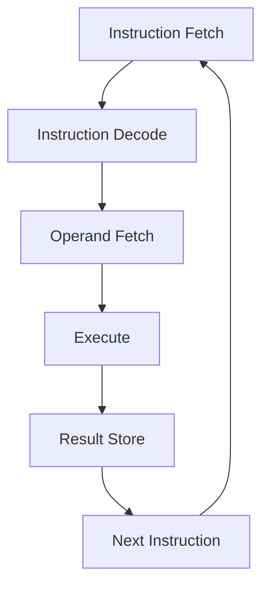

名称
- 数字逻辑和计算机组成
- 考核
	- 课后作业、问答：15%
		- [click me check the 3 chapter assignment|600](https://kold.oss-cn-shanghai.aliyuncs.com/d18405c59099b86d65d4996969d22007.png)
		- [[DL-CO-3]]
		- [[DL-CO-4]] 
		- [[DLCO-6]]
		- [[DLCO-7]]

	- 六次实验成绩: 35% （实验验收、报告）
		- [[ DLCO-labs-note| About labs]] 
		- [[DLCO-lab1-report]]
		- [[DLCO-lab2-report]]
		- [[DLCO-lab3-report]]
		- [[DLCO-lab4-report]]
		- [[DLCO-lab5-report]] 
		- [[DLCO-lab6-report]]
- 


- 世界上第一台电子计算机 ABC（非通用）
	- 不可编程
- 通用电子计算机 ENIAC
	- 能变成
	- 二进制
	- 非存储程序
	- 非冯诺伊曼结构
## 附录

### 电路符号
- Some Note
- 


## [[DLCO - Data in Computer]]
## [[Logic Gate and CMOS]]
## [[DLCO-BooleanAlgebra]]
##  [[组合逻辑电路]]


## [[时序逻辑电路]]

##  [[DLCO - FPGA 设计和硬件描述语言]]


## 运算方法和运算部件

### 加法器
- 全加器和半加器
	- 
- **串行进位加法器**
	- 
- 并行进位加法器（CLA）
	- Carry look ahead
	- 通过逻辑方程代入，知道各进位之间无等待，可以相互独立并同时产生。
	- 
	- 
- **还有一种折中的办法**
	- 局部（单级）先行进位加法器。

### 带标志的加法器

- `n` 位**带标志**加法器
	- **标识位**用来携带一些信息。
		- 例如溢出 `OF` [[ICS#IA-32 定点寄存器组织|OF寄存器了解]]
			- $OF=C_{n}\oplus C_{n-1}$
			- 原理：`正数加正数得到负数` 和 `负数加负数得到正数` 是溢出的两种，恰好可以用符号位进位 `C_n` 和下一位 `C_n-1` 标识
		- 符号标识位 `SF`
			- $SF=F_{n-1}$
		- 零标识位 `ZF`
			- $ZF=1\iff F=0$
		- 进位标识位 `CF` (Carry)
			- $CF=Cout\oplus Cin$ 
				- `Cout` 是最终输出进位信号
				- `Cin` 是输入的进位信号
				- 如果 `Cout^Cin == 1`，说明中间进位发生了翻转，即产生了新的进位。
	- 我们构造了**带标志加法器**
	- 
	- 

- **** 算术逻辑部件（ALU）
	- 
	- `ALUop` is actually a `S` in selector circuit. the function of various output is implemented by multi-selector.
- 

### n 位整数加/减运算器


### 无符号整数乘法运算

$P_{i}=2^{-1}(Xy_{i}+P_{i-1})$

- 一个巧妙的 trick
- 将进位巧妙的移入**乘积空间**

- 需要的储存空间：
	- 第一个 `X` 的寄存器
	- 双倍字长的乘积寄存器 `P（Product）+ Y(乘数)`
	- 一个进位 flag `C`


- `32bit` **无符号乘法运算的硬件实现**


- **移位**需要用时钟控制。
	- 引入计数器，计数器运算次数等于乘数 bit 数
### 原码乘法算法
- **用于浮点数尾数乘运算**
- 数值部分：用无符号乘法算法计算
- 符号位：`0 ^ 1 =1`

- 一位乘法：每次只取一位乘法，效率较慢。
- 二位乘法：每次取两位进行运算。
	- 涉及到一些技术细节：
		- 处理符号位
		- 处理新的移位表达式
	- 


### 补码乘法运算
- **符号**和**数值**一起运算，算术右移
	- 
	- **我们可以先不考虑小数点位置**，只需要在最后约定即可。
	- 这样可以简化我们推导。
$$
[x+y]_{补}=\left[ x \times \sum_{i=0}^{n-1}(Y_{i-1}-Y_{i})2^{i}\right]_{补} 
$$
	- 该求和项，实际就模拟了我们手算的过程。我们可以将每一个部分前缀和是部分 `product`，那么
$$
[P_{i+1}]_{补}=[2^{-1}(P_{i}+(Y_{i-1}-Y_{i})x)]_{补},\;(i=0,1,2,\dots,n-1)
$$

- Booth's 算法
- Booth's 算法实际上是在我们上述递推关系的实际应用：
	- 一旦乘数中相邻两位 $Y_{i}Y_{i-1}$ 已经确定，我们就可以让计算机方便的处理，具体遵循以下算法。
	- if $Y_{i}Y_{i-1}=01$, $[P_{i+1}]_{补}=[2^{-1}(P_{i}+x)]_{补}$
	- if $Y_{i}Y_{i-1}=10$, $[P_{i+1}]_{补}=[2^{-1}(P_{i}-x)]_{补}$
	- if $Y_{i}Y_{i-1}=11,00$, $[P_{i+1}]_{补}=[2^{-1}(P_{i}+0)]$
整理为算法，`11，00` 实际是什么都不做。
```
输入：M, Q (均为补码表示，n位)
A = 0
Q_-1 = 0
repeat n times:
    if (Q0 == 0 and Q_-1 == 1):
        A = A + M
    else if (Q0 == 1 and Q_-1 == 0):
        A = A - M
    右移算术移位 (A, Q, Q_-1)
end repeat
结果 = (A, Q)
```


- **用途**：
	- 有符号整数乘法运算。
### 整数的乘运算（溢出）
- 两个 `n` 位乘法结果应该是 `2n` 位
- 如果结果仅保留低 `n` 位，`X*Y` 的高 n 位可以用来溢出判断，规则如下：
	- **无符号**：高 `n` 位全 `0`，则不溢出，否则溢出
	- **带符号**：若高 `n` 位全 `0` 或全 `1` 且等于低 `n` 位的最高位，则不溢出。
		- 即 `进位` 并没有产生低 `n` 位的最高位产生向符号位进位的情况。即没有**数值**信息被进位上去


### 原码除法运算

首先进行取之和大小进行判断。
- 若被除数为 `0`，除数不为 `0`，（或者整数 $|a|<|b|$, $a/b$），商为 `0`，余数为被除数
- 若被除数不为 `0`，除数位 `0`，整数 throw `divider cannot be zero`, 浮点数 `inf`
- 都为 0. 整数发生除法错异常；浮点数，有的机器会产生一个 `quiet NaN`

除法本质是连续的减法。

**减法操作用补码**，所以如果是**无符号数**也需要补一个**符号位**（余数也要留）

- 原码判断够不够减：
	- 得到负数不够减，否则够减

### 恢复余数法

恢复余数法的核心思想是通过**重复的减法和移位操作**来**模拟人工**进行长除法的过程。在每一步骤中，它会尝试用**被除数或当前余数**减去除数，并根据结果来决定：

1. **如果相减的结果是非负的（即余数够减）**：说明商的当前位是 **1**。相减后的结果作为新的余数，且**不需要**恢复。
    
2. **如果相减的结果是负的（即余数不够减）**：说明商的当前位是 **0**。相减后的结果是错误的，需要将**除数加回（即恢复）**，以得到正确的余数，因此得名“恢复余数法”。

总结伪代码：
```
if (R_i >= 0){
	上商1
	R << 1, Q << 1 下一次试商 得到下一次余数 R_{i+1}
	即 R_{i+1} = 2R_i - Y
}
```

我们需要把 **被除数** 进行拓展


## Floating-point number

 **浮点数运算结果**
$A=M_{a}\cdot_{2}^{E_{a}}$
$B=M_{b}\cdot 2^{E_{b}}$

则
$$
A\pm B=(M_{a}\pm M_{b}\cdot2^{-(E_{a}-E_{b})})\cdot{2}^{E_{a}}
$$

### 加减法

四个步骤：
- **对阶**
- **尾数加减**
- **尾数规格化**
- **尾数舍入**

## ISA
**从指令执行周期看指令设计涉及的问题**



参考 PA
[[ICS-PA2 note#更新 PC|如何更新PC]]

- IBM370
**思考**：我们用 16 个通用寄存器来做，**编号需要几位**？
- `4` bit


- **不同指令设计风格**
- CISC
	- Complex Instruction Set Computing
	- 通用寄存器型
- RISC
	- Reduced Instruction Set Computing
	- load/store 型
	- 也用内存，但是必须有专门的访问内存的指令
中断：
- **内部中断**
- **外部中断**
	- **打印机缺纸**


### RISCV 寄存器约定
可以阅读 [[ICS-PA2 note#`riscv` 如何判别 `call` 和 `ret`？|riscv判别`call`和`ret`的办法]]

### 具体指令

你参加的 PA 是 `riscv32` 的，这对你再熟悉不过 [[ICS-PA2 note]] 

**这门课需要你更注意一些基于这些最基本指令的高级语言层面操作**。

> [!Note] `long long` 64bit 数相加的机器级表示
> x 的高、低 32 位分别存放 `x13`, `x12`
> y 的高、低 32 位分别存放 `x15`, `x14`
> z 的高、低 32 位分别存放 `x11`, `x10`

 在以上假设下，我们可以用 `sltu` 将低 32 位的进位加入到高 `32` 位中
- **为什么**？如果 `sum < 两个加数`，一定产生了进位。
```asm
add 	x10,	x12,	x14
sltu	x11,	x10,	x12		// if x11(low_x+low_y) < x12, then R[x11]<-1
add		x16,	x13,	x15		// R[x16]<-R[x13]+R[x15] (high_x+high_y)
add		x11,	x11,	x16		// R[x11]<-R[x11]+R[x16]	(compute carry bit)
```


## CPU  中央处理器
- 指令执行过程
- CPU 的基本组成
	- **操作元件**(组合逻辑元件)
	- 状态/存储元件（时序逻辑元件）
- 数据通路与时序控制
- 计算机性能和 CPU 时间
### CPU 基本组成


### CPU 基本结构
- 计算机的五大组成部分
- 

- Control Unit （控制器）
	- 指令的控制部件
- Datapath （**数据通路**）
	- 指令的执行部件
- Memory
- Input
- Output

 **除了存储元件**，**都是组合逻辑电路**。
#### 数据通路
- **两类元件**
	- 组合逻辑（操作元件）
	- 时序逻辑（状态元件、存储元件）
- 元件间的连接方式
	- 总线连接方式
	- 分散链接方式
- 数据通路的具体工作
	- 进行数据存储、处理、传送

- 

- **数据通路**是由 **操作元件** 和 **存储元件** 通过总线方式或分散方式连接而成的进行数据存储、处理、**传送的路径**。

#### 存储元件：寄存器和寄存器组
- 寄存器 (Register)
	- has a `Write Enable-WE` signal
	- `0`: when clock edge come, output stay the same
	- `1`: when clock edge come, output is becoming the input
- 寄存器组 (Register File)
	- **Two** read port (组合逻辑)
		- busA, busB
		- address given by `RA`, `RB`
		- After a Access Time, busA busB becoming valid
	- **One** write port (时序逻辑)
		- Write Enable == 1:
			- when clock edge come, write the value from busW to the register assigned by RW


#### 时序控制

- **锁存延迟**(Latch Prop, a.k.a Clk-to-Q)，即触发器的锁存延迟
- **时钟偏移**(Clock Skew): 由于工艺、走线延迟等原因造成的时钟信号的偏差。
- Longest Delay Path: **关键路径**。组合逻辑的最长路径。


- **现代时钟周期**


#### CPU 性能
- CPU **执行时间**
	- CPI: Cycles Per Instructions
- Time to do the **task**
	- response time
	- execution time
	- latency
- Tasks per day, hour, sec, ns...
	- 吞吐率 (throughput)
	- 带宽（bandwidth）

- 

CPU 性能 (CPU performance): User CPU time
系统性能 (System performance): 一般指没有其他负载时的响应时间


$$
吞吐率=单位时间内运行的作业(指令)数(有或无负载/干扰)
$$


- 


**产品宣称指标**：Marketing Metrics

- MIPS
- MFLOPS


### 设计处理器的步骤
确定 ISA 后，我们进行处理器设计的大致步骤：

- **分析每条指令的功能**，并用 RTL（Register Transfer Language）来表示
- 根据指令的功能给出所需的元件，并考虑如何将他们互连
- 确定每个元件所需控制信号的取值
- 汇总所有指令所涉及到的控制信号，生成一张反映指令与控制信号之间关系的表
- 根据表得到每个控制信号的逻辑表达式，据此设计控制器思路


我们用 RISC-V 所例子

## 数据通路


指令执行结果总是在下一个时钟到来时开始保存在**寄存器**或 **存储器** 或 **PC** 中


### 指令开始时，取指部件中的动作
Fetch instruction: `Instruction <- M[PC]`
- All instruction is same
- When clock signal come, PC is updated to `s->dnpc` (dynamic next pc)

- previous: 上一条指令遗留下的指令


- R-type 控制信号：
	- `RegWr = 1`: 我们需要写入寄存器
	- `ALUASrc = 0`: 
		- 我们不需要 `imm` ,自然也不需要立即数
	- `ALUctr = add/slt/sltu`
	- `Jump` 和 `Branch` 都是 `0`，只有 `J/B` 才为 1
	- `ExtOp = x` (任意)，即 R 不需要拓展立即数
	- `ALUBSrc = 0`
		- 我们不需要 `imm` ,自然也不需要立即数
	- `MemWr =0`
		- R 型不需要读写内存
	- `MemtoReg = 0`
		- 同理


- U-type 控制信号


## 多周期处理器

思想：
- 把每条指令的执行，**分为多个阶段**。每个阶段在一个或多个时钟周期内完成；
- 每个时钟周期称为一个**状态**，期间最多完成一次访存或一次寄存器读写或一次 ALU 操作。
- 每个时钟内的执行结果在下个时钟到来前，保存到相应存储元件或者稳定地保持在组合电路中
- **时钟周期的宽度以最复杂**阶段的所用的时间为准。

**思考**：指令有几个阶段？
1. fetch inst 
	- read storage
	- read inst due to pc. put it in `IR`
	- IR will not be update at every clock. So it need a write-enable
	- when fetch-inst ended, `alu` output is `PC+4`, send it to input of PC. But, you can't update `pc` at every clock. so pc need a write-enable
2. decode / read register
	- after control-logic-delay, update control signal
	- do read register, and decode
	- `alu` is free at this period. You can use it 
3. alu
4.  read/write store
5. write the result

**多周期处理器的好处**
- 时钟周期更短
- **不同指令所用的周期数可以不同**
	- 如 `Load: 4? 5? cycles`
	- Others: `2? 3? 4? cycles`


简单指令系统-对应的多周期 CPU：

- **控制器**：提供一个 of，zf 的寄存器
- **指令寄存器**：
- **MAR**
	- 给出数据地址

- **有个三态门**：`PCout, MARout,` **控制能否向总线** 写出
- 我们把地址总线、控制总线、数据总线简化画成了一个大总线。
	- `PCout, MARout` 走地址总线。**数据送到主存**

#### 各类指令执行过程
- 取指令并计算下一条指令地址：`IFetch`
- 
- 译码并取数（公共操作）记为 `Rfetch/ID`
- **投机计算**：当前时钟结束，下个时钟来之前可以投机计算
	- 
	- **所有控制信号不是同时生成的**。
- R-型指令的执行。两个时钟周期：`RExec, RFinisih`
	- 

- I-型指令的执行，需要两个时钟周期。`IExec, IFinish`
- Load 指令：地址已经投机计算，还需两个时钟周期。`lwExec, lwFinish`
	- 根据投机计算好的地址（MAR中）到主存中取数，送MDR，再将MDR内容写入Rt。
- Store 指令：地址已经投机计算。还需要两个时钟周期 `swExec, swFinish`
- Jump 指令：计算转移目标地址。送 PC。需一个时钟周期
- 


- 状态转换图
- 


**多周期控制器的实现**
**回忆单周期**：控制信号在指令执行过程是不变的。用真值表可以反映指令和控制信号的关系。

但是多周期
- 每个指令周期不同
- 控制信号取值不同
前面我们已经讨论了指令执行的不同阶段，受此启发，**可以构造状态转移图**。


- 和状态转移图完全对应。


- 流水线数据通路


### 流水线的三种冒险
1. **数据冒险**：当指令在流水线中重叠执行时，后面的指令需要用到前面的指令的执行结果，而前面的指令尚未写回导致的冲突，称为数据冒险（也称为**数据相关性**）。
2. **结构冒险**：当一条指令需要的硬件部件还在为之前的指令工作，而无法为这条指令提供服务，那就导致了结构冒险。（这里结构是指硬件当中的某个部件、也称为**资源冲突**）。
3. **控制冒险**：如果现在想要执行哪条指令，是由之前指令的运行结果决定，而现在那条之前指令的结果还没产生，就导致了控制冒险（实际上就是 risc-v的跳转指令引起的，跳转指令要经过2个周期后才会出现**跳转结果**）
具体的冒险可以看后面：[[#延迟]]


### 流水线控制器
**流水线控制器的实现**
- ID 段生成所有控制信号，并随指令执行过程信息同步向后续阶段流
- 与单周期处理器的控制器的实现方法一样，无需采用有限状态机
- 


我们有一些流水线段寄存器，比如 `IF/ID`, `ID/EX`, `M/WB`, 来存储周期执行过程中的一些信息

- `M/WB`
	- 
	- 


### 流水线各个阶段


- **第八周期**
	- 需要新的地址回送 PC，出现**反向数据流**


#### 延迟
- **数据冒险 (Data Hazard)**
- 描述数据冒险，**一定要说清楚指令之间**
- 
- 第一条 `load` 指令在第 5 周期才能完成 `Write`，但这涉及到数据冒险（Data Hazard）
- `load` 的延迟效应。中间要延迟三个周期，才能在下一个 `R-type` 指令到来时，其取数取到正确的值
	- 

- **转移指令的延迟**
- **控制冒险**(Control Hazard)
	- 
	- **取错了几个指令**！

#### 数据冒险的解决

- 硬件阻塞 (stall)
- 软件插入 `NOP` 指令
- 合理实现寄存器堆的读/写顺序 
	- 同一周期内寄存器先写后读
- **转发 (Forwarding** 或 **Bypassing 旁路)** 技术（不能解决所有的数据冒险）
- 编译优化，调整指令顺序

1. **硬件阻塞**：stall, 插入气泡
	1. 比如：`add r1, r2, r3` -> `stall` -> `stall` -> `stall` -> `sub r4, r1, r3`


2. 合理实现寄存器堆的读/写顺序 
	1. 我们需要写口读口是独立的
	2. 同一周期内寄存器先写后读。间隔两条以上的，可以避免冒险。
3. 利用 DataPath 的中间数据：转发 (Forwarding)
	1. 我们使用了原有数据通路额外的通路，将数据提前转发给需要的指令。
	2. `EX/M` 寄存器记录了 `R-type` 指令的中间结果，可以开一个转发通路
## test
- 都是简答题
- 电路和 CPU
- **时序电路设计**
	- 状态设计
	- 卡诺图化简
- **CPU**
	- 不能单靠 CPU，相关联的几个题
	- 后面这部分没有画图了
	- 分析计算。