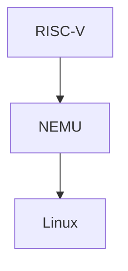

# 计算机系统基础

**Programming Assignment**: PA

- base : RISC-V

## 基本情况

| PA  | Labs | Homework | Exam |
| --- | ---- | -------- | ---- |
| 30% | 10%  | 10%      | 50%  |

PA scores:
- DDL 前提交
	- 10% bonus
	- 100% 封顶
- DDL 后提交
	- 不加分不扣分
	- 消除 ddl 焦虑
- Hard DDL
	- 80%分数

| PA0 | PA1 | PA2 | PA3 | PA4 |
| --- | --- | --- | --- | --- |
| 10% | 25% | 25% | 25% | 15% |

PA 实验终极拷问：
- When you run a Hello World program, what did computer do?

- NEMU
	- 用软件模拟出“计算机”
- 用 NEMU 红白机模拟器玩超级玛丽

- 调试 RISC-V 用自己实现的 NEMU 的框架
- 调试 NEMU，用 linux

- 远程桌面
	- 服务端：
		- xfce+xrdp
	- 客户端
		- windows remote desktop

## 噩耗？开始汇编

在期末考试，你需要掌握 x86-64 的反汇编的阅读能力，背诵二进制代码的指令
`0x55`：push

