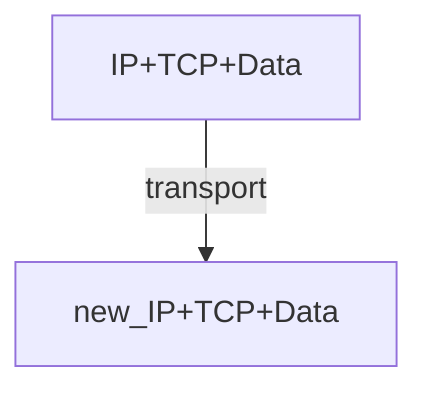

分数据平面和控制平面介绍。

# 数据平面 Data Plane
- Network Layer Functions 
- IP Protocol Basic 
- IP Protocol Suit 
- Routing Fundamentals
- Internet Routing Protocols
- IP Multicasting
网络层：transport segment from sending to receiving host
- network layer protocols in every host, router 

有两个主要的网络层方法(network layer function)
- 
路由 Switch/router 

	- Routing determines the forwarding table
- 
 Forwarding （Move packets）

	- Queuing and scheduling
	- Host to Switch
	- Switch to Host 
	- Switch to Switch 

**Network v.s. transport layer connection**：
- *network*: between 2 hosts (end to end)
- *transport*: between 2 processes

## Router 工作原理
### input port function
Longest prefix matching rule(最长前缀匹配)
![[longest-prefix-matching-rule.png]]

使用一个**路由树** 可以达到大概 $O(\log n)$ 的查找速度

![[prefix-matching-tree-structure.png]]

在传输过程中， 

IP header 传输过程发生变化，但是 TCP header 和 data 保持不变。（做过 exp2 的你应该会对此理解更深刻）

### output port functions
![[output-port-functions.png|400]]
we will classify an IP packet based on a number of fields in the packet header, e.g.,
- Source/destination IP address(32 bits)
- Source/destination TCP port number(16 bits)
- Type of service (TOS) bytes （8 bits）
- Type of protocol (8 bits)

### Connecting inputs to ouputs
- Transfer packet from input to output
- Three types of switching
- ![[switching-fabrics.png]]
	- 共享内存：不支持并发访问。一个内存一次只能处理一个路由
	- 总线（bus）：不支持并发访问。因为一次只有一个分组能跨越总线
	- 纵横总线：可以并发访问。
### Implement Protocols
![[datagram-vs-virtual-circuit.png]]
Datagram： IP 协议。用性能消耗，获得拓展性。
Virtual Circuit：需要专用的资源，牺牲了用户来换取性能。
## Datagram（IP）
本节课我们主要学习 IP
## Virtual Circuit（虚电路）
和 IP 层是两种不同的实现方式。但是现在用的人已经很少了。
## IP (Internet Protocols)
### 需要支持的功能
- Routing 
- Datagram lifetime
- Fragmentation and re-assembly
- Error control
- Flow control

### Routing
Host and routers maintain *routing tables*
- indicate next router to which datagram should be sent 
### Datagram Lifetime
mark datagram with *lifetime*, so it won' t live forever.
Once lifetime expires, datagram is discarded instead of forwarded

### Fragmentation and Re-assembly
（切片和组装）
Length of a packet exceeds the coming network’s **MTU (maximum transmission unit**
one segment in its transmit may fragment and re-assemble.
Ques:
- WHEN to fragment?
	- Host – determine min of MTUs along the path 
	- Router – fragment if the next MTU is exceeded
- WHEN to re-assemble
	- Host – Packets getting smaller as data traverses internet 
	- Router – infeasible since fragments may take different routers
如果出错了(重组失败，因为一些部分(fragment)丢失)——>增加 timeout 机制
### Error Control
- Not **guaranteed delivery** 
- Router should attempt to inform source if packet discarded 
	- e.g. for **checksum failure, TTL expiring** 
	- Datagram identification needed 
- ICMP used to **send error message**
- Source may inform higher layer protocol

###  Flow Control
允许路由器(routers)来限制涌入数据的量
- Limited control functions in connectionless system
- New mechanisms coming soon
Router discards incoming packets when **buffer is full**
- using ICMP
### IP Packet Structure
#### Header
![[Pasted image 20250402104503.png]]
IP 头动态部分
- TTL：time to live 会更新。
- checksum：由于 TTL 更新，重新计算 checksum
### IP Addressing
- IP address
	- 32 bit global internet address for each interface (32 bit ，4 bytes)
		- 采取 `点分十进制记法` (dotted-decemal notation )
		- 即每个字节用十进制书写
	- Network part(high order bits )
	- Host part (low order bits)
- **Physical network**
	- Can reach each other without intervening router（无路由器参与的最大连通分支）
![[IPv4-address-formats.png]]
用前缀标志类型 ABCDE

#### Class A
A类地址： 首位为0； 支持27-2=126个网段； 每个网段支持主机数为224-2 =16777214（全0和全1的地址要扣除， 全0是网络号，全1是广播号

- Range 1.x.x.x to 126.x.x.x
**ALL ALLOCATED**（全部分配完了）
#### Class B
首位为 10
Range 128.0.x.x to 191.255.x.x

**ALL ALLOCATED**（全部分配完了）
#### Class C
Start with 110
Range 192.0.0.x to 223.255.255.x
- 221 = 2,097,152 networks 
- Up to 254 (=28-2) host
- 
**NEARLY ALL ALLOCATED**

#### Inter-Networks with Addresses
![[inter-network-with-addresses.png]]
#### 子网掩码(subnet mask)
用来标记是否在一个子网中。
子网掩码 (subnet mask)又叫网络掩码、地址掩码、子网络遮罩，它**用来指明一个 IP地址的哪些位标识的是主机所在的子网，以及哪些位标识的是主机的位掩码**。子网掩码不能单独存在，它必须结合IP地址一起使用。子网掩码是一个32位地址，用于屏蔽IP地址的一部分以区别网络标识和主机标识，并说明该IP地址是在局域网上，还是在广域网上。

#### IP 的获取（DHCP）
DHCP（Dynamic Host Configuration Protocol, DHCP）动态主机配置协议。
- DHCP 允许主机自动获取（被分配）一个 IP 地址
- 即插即用能力（plug-and-play protocol）

连接过程：DHCP 是一个 4 步骤的过程。
- DHCP 发现
	- client 在 UDP 分组向端口 67 发送该发现报文。
	- src: 0.0.0.0 dst: 0.0.0.0 (广播地址)
- DHCP 提供
	- 使用 DHCP offer message 做出响应。向该子网的所有节点广播（广播地址 255.255.255.255）
- DHCP 请求
	- 新到达的客户从一个或多个服务器中选择一个，并向选中的服务器提供用 DHCP 请求报文 (DHCP requset message) 进行响应，回显配置的参数。
- DHCP ACK
	- DHCP ACK 报文（DHCP ACK message）对 DHCP 请求报文进行响应，证实所要求的参数。

### IPv6
#### header structure
- Version (4 bits): 6 
 - Traffic Class (8 bits) 
	 - Classes or priorities of packet, identify QoS 
- Flow Label (20 bits) 
	- Identify datagrams in the same “flow” 
 - Payload length (16 bits)
	- Includes all extension headers plus user data
 - Next Header (8 bits) 
	 - Identifies type of the next header 
	 - Extension or next layer up 
 Source / Destination Address (128 bits)
![[ip-packet-structure.png]]

#### Transition from IPv4 to IPv6
有两种推荐的方法：
- Dual Stack – some routers with dual stack (IPv6, IPv4) can translate between formats 
- Tunneling – IPv6 carried as payload in IPv4 datagram among IPv4 routers（以现有的 IPv4 设施传输 IPv6 数据报）IPv6隧道是通过将IPv6数据报封装在IPv4数据报中，利用现有的IPv4基础设施来传输IPv6流量。这种机制被称为**隧道封装**，IPv4网络在这种场景中只是作为传输介质，而不是直接的链路层协议。

### 网关

### Network Address Translation
- NAT（网络地址转换，许多同学的 ip 映射为一个统一的 nju 出去的 ip）
	- Enables different sets of IP addresses for internal and external traffic 
三种 NAT
- Static NAT
- Dynamic NAT 
NAT 也起到了一个 **防火墙** 的作用。外界的攻击很难直接攻击虚拟 ip

## 子网 subnet
- 一个子网（们）的例子
- ![[subnets.png]]
### 为什么需要子网？
子网解决的是“网络地址不满足问题”（network inadequacy）

- Host portion of address partitioned into **subnet** number and host number
	- 子网掩码 (subnet mask)  indicates which bits are ==subnet number==, and which are host number
	- Each LAN assigned a subnet number, more flexibility
	- Local routers route within subnetted network
- 在对外界通信时，一个子网系统可视作一个单独的网络 (代表)（Subnets looks to rest of internet like a single network）
	- Insulate overall Internet from growth of network numbers and routing complexity
![[subnets-to-the-rest.png]]
可见，一个子网系统中的网络以同一个单独的 `141.14.0.0` 向外沟通。
同理 `the rest of the internet` 来了 datagram，也通过子网系统做路由

### CIDR Notation（子网地址）
- CIDR ( Classless Inter Domain Routing)
- 一个 IP address 可以表达为 `A.B.C.D/n` 的形式，where `n` 被叫做 IP (network） prefix
- 一个例子：`192.168.0.1/24`
	`n` 为 24，e.g.，则表示 IP 的前 24 位是网络地址，剩余 8 位是主机地址。（子网中的标记）
	

![[cidr-notation.png]]
为了更熟悉 `CIDR` 表示以及如何分配，可以看这个题[[KoldGoNote/S04/计算机网络/homework/HW4_231275036_朱晗#P15（子网分配问题）|子网分配问题p15]]

# 控制平面 Control Plane
## Rounting 路由
这部分是典型的**图问题**：网络中有很多节点，网络连接有代价，即权值。这自然涉及到最优化网络通信代价——如何设计通信路径即设计路由的方法。
Dijkstra 算法和 B-F 最短路径算法广泛应用
### IGP
- IGP
	- **RIP**（Routing Information Protocol）1 st Generation
		- 信息使用：Distance Vector (DV) 距离向量
		- 路径算法：B-F
	- **OSPF**（Open Shortest Path First）
		- 信息：LS（Link state）
		- 算法：Dijkstra
		- OSPF正是使用SPF算法(即 Dijkstra)来计算最短路径树。它使用“Cost”作为路由度量。使用链路状态数据库（LSDB）用来保存当前网络拓扑结构，路由器上属于同一区域的链路状态数据库是相同的（属于多个区域的路由器会为每个区域维护一份链路状态数据库）。![[SPF-tree.png]]
#### RIP vs OSFP
- RIP
	- 配置简单，适用于小型网络（小于 15 跳）
	- 可分布式实现

	- 收敛速度慢
	- 网络是一个平面，不适合大规模网络
- OSPF
	- 收敛速度快，无跳数限制
	- 支持不同服务类型选路
	- 支持身份认证
	- 支持层次式网络

	- 集中式算法
	- 每个节点需要维护全局拓扑
	- 配置复杂

### BGP (Border Gateway Protocol)

网络中边缘的网络节点来对话的问题。