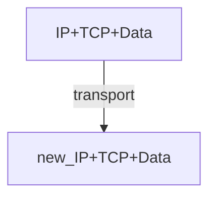

# 运输层
无连接的：connectioness 
	 不区分 IP，只关心 port
- UDP is connectionless
## **什么是 Socket？**
**socket**: software abstraction for an application process to exchange network messages with the (transport layer in the) operating system

- Transport layer addressing
	- <HostIp, Port>, called a socket
- Two important types of sockets
	- UDP socket: TYPE is SOCK_DGRAM
	- TCP socket: TYPE is SOCK_STREAM
- 对 TCP 服务器的 socket 理解：TCP 需要两个 socket, 一个是欢迎套接字（握手），一个是连接套接字。

**Connection less **

**Connection-oriented demux**
4 个要素确定一条链接：
- Host IP address 
- Host port
- Client IP address 
- Host port
- Multiplexing (Mux)
	Gather and combining data chunks at the source host from different applications and delivering to the network layer

- Demultiplexing (Demux)
	Delivering correct data to corresponding sockets from multiplexed a stream

## 怎么构建 Reliable Transport
- Mechanics to cope with bad events
	- CheckSum: a simple way to detect corruption 
	- ACKs: (ACKnowledge) receiver tell sender that it received packet
	- NACK: receiver tell sender that it didn’t receive packet

## 计算传输时间

E.g. 1 Gbps link, 15 ms prop. Delay, 8000 bit packet
$$
D_{trans}=\frac{L}{R}=\frac{{8000 bits}}{10^{9}bits/\sec}=8microsecs
$$
If $RTT=30ms$
Round-Trip-Time:
- 一个短分组从客户到服务器然后再返回客户所花费的时间
- 包括分组 propagation delay, queue delay, and packet process delay
在本题的例子里，RTT 严重拖累了效率，我们想到改良方法

### Pipelining: increase dutilization 
![[a0e859817c285cb7e429923a8f237af2_720.png]]

### Sliding window
#### What is sliding window
It decides which packets can sender send.

- **Window**=set of adjacent sequence numbers
	- The size of the set is. The window size
- General idea: send up to n packets at a time
	- Sender can send packets in its window
	- Receiver can accept packets in its window

### Sliding window protocols

- Resending packets: 2 canonical **approaches**
	-  Go-Back-N(GBN)
		- 回退 N 帧，只要不是正确按序接受，就重传上一个正常之后的所有。
	- Selective Repeat(SR)
Many variants that differ in implementation details

#### example
提供一个 example
比较 GBN、SR 和 TCP（无延时的 ACK）。假设对所有 3 个协议的超时值足够长，使得 5 个连续的数据报文段及其对应的 ACK 能够分别由接收主机（主机 B）和发送主机（主机 A）收到（如果在信道中无丢失）。假设主机 A 向主机 B 发送 5 个数据报文段，并且第二个报文段（从 A 发送）丢失。最后，所有 5 个数据报文段已经被主机 B 正确接收。

 a. 主机 A 总共发送了多少报文段和主机 B 总共发送了多少 ACK？它们的序号是什么？对所有 3 个协议回答这个问题。
b. 如果对所有 3 个协议超时值比 5 RTT 长得多，则哪个协议在最短的时间间隔中成功地交付所有 5 个数据报文段？

a.
- GBN
对于 GBN，其会重传异常之后的所有报文。
所以 A 发送 1+4+4=9 个 segments
B 正常接受 1，ack 1
回复 3, 4, 5, ack 3, 4, 5
重传的 2, 3, 4, 5，ack 2, 3, 4, 5
总共 9 segments ; 8 ack
- SR
第二个报文丢失后，接收方缓存 3, 4, 5，回传的 ACK 序号分别为 1 3 4 5，第一轮 4 个 ACK。
第二轮发送方重传 2，接收方回传的 ACK 为 2，第二轮 1 个 ACK

总共 6 segments 5 ack
- TCP
第二个 segment 丢失后，接收方缓存 3, 4, 5，ack: 2, 2, 2, 2
3 个冗余 ack，进入重传，发送方重传 2
接收方处理排序后，回复 ack6 表示已完成整理。
总共 6 segments  5 ack

b.
TCP 最快。因为 TCP 没有“傻傻”的等待 2 的正确传输，而是先缓存处理后面的，再冗余 ack 后快速进入重传。

## UDP CheckSum
Check sum：将 segment 各位加和，获得一个 16 位的 binary numbers，并取反。
然后，接收端也进行加和，与 Checksum 相加如果等于 0，就说明校验成功。（上一步取反是为了这一步比较“校验和相同”能比较简单.）

## TCP
Transmission Control Protocol
### TCP Abstraction
TCP delivers a reliable, in-order, byte stream 
- Reliable: TCP resends lost packets (recursively) 
- Until it gives up and shuts down connection
- In-order: TCP only hands consecutive chunks of data to application 
- Byte stream: TCP assumes there is an incoming stream of data, and attempts to deliver it to app
### TCP header:
Size: 20 byte
![[Pasted image 20250317103054.png|Header图]]

- 序列号 (Sequence number)
Starting byte offset of data carried in this segment

### TCP segment
![[Pasted image 20250317104032.png]]
### Sequence numbers
**TCP 序列号**（Sequence Number）是 TCP 协议中用于跟踪数据传输的重要机制。每个 TCP 会话的每一端都包含一个 32 位的序列号，用于跟踪该端发送的数据量。序列号在 TCP 数据包的头部中，每个数据包都包含一个序列号，用于标识该数据包在整个**数据流中的位置**

1) ISN (Initial Sequence Number), k bytes
2) $Sequence\;number$ = 1 st byte in segment = $ISN+k$

### Loss with cumulative ACKs
When **data loss** happened,  assume 5 th packet (seqno 500)  is lost, but no others, then ACKs will be:
	200,300,400,500, (seqno:600), 500, (seqno:700)...

Sender: always get ACK 500 ever since 5 th packet loss
Receiver: get packet seqno: 600,700... But send ACK 500

**BUFFER the out-of-sequence packets**

Introduce: *fast retransmit*
---
Duplicate ACKs trigger early retransmission

具体而言：如果 sender hasn' t received an ACK by timeout, *retransmit hte first packet in the window*

## 掉包问题解决与拥塞控制

### RENO 算法

慢启动
`if CWND <ssthresh: CWND+=1 ` slow start phase
`Else: CWND =CWND+1/CWND`

`dupACK`：计算掉包。一旦发生三次重复 `ACK` 认为是丢包
`if dupACKcount >= 3 ` 进行快重传(fast transmission)

*Problem*: 这个算法在偶发丢包时候，**性能**特别差

### NEW Reno
在 Reno 基础上 利用快恢复算法(fast recovery)

### 近年的算法
**Cubic**: 相对温和
**BBR**: 比较 aggressive

## 各种窗口 (wnd)
### TCP Window 与 cwnd 的区别

TCP 是一种流量控制协议，通过窗口机制（Window）动态调节数据发送速度。窗口机制主要包括 **接收窗口（`rwnd`）** 和 **拥塞窗口（`cwnd`）**，它们共同决定了 TCP 传输的效率。

---

### 1. TCP Window 概念

TCP 的 **Window（窗口）** 是指接收端和发送端之间用于控制数据流量的机制，确保发送方不会超出接收方的处理能力。窗口的大小由两部分控制：

- **接收窗口（`rwnd`）**：
    
    - 由接收端通告给发送端。
    - 表示接收端当前缓冲区可以接收的字节数。
    - 发送端根据 `rwnd` 确定能发送的数据量，避免接收方缓冲区溢出。
- **拥塞窗口（`cwnd`）**：
    
    - 由发送端动态维护，用于实现拥塞控制。
    - 表示网络路径上允许的未确认数据量。
    - 随网络拥塞情况调整，以避免过度占用网络带宽。

**最终允许发送的数据窗口大小**：

Effective Window=min⁡(rwnd,cwnd)\text{Effective Window} = \min(\text{rwnd}, \text{cwnd})

---

### 2. `cwnd`（拥塞窗口）

#### 
(1) 定义

`cwnd` 是发送端维护的一个动态值，用来实现拥塞控制策略，反映网络当前的承载能力。`cwnd` 的值会随着网络状态动态变化，以下是它的变化机制：

#### (2) 增长机制

- **慢启动（Slow Start）**：
    - 初始时，`cwnd` 通常较小（例如 1 个 MSS，最大分段大小）。
    - 每次收到 ACK，`cwnd` 值按**指数增长**，直到达到**慢启动阈值**（`ssthresh`）。
    - 防止在网络状态未知时过快占用带宽。

$cwnd \leftarrow cwnd + MSS$

- **拥塞避免（Congestion Avoidance）**：
    - 当 `cwnd` 超过 `ssthresh` 后，进入**线性增长阶段**。
    - 每轮次（RTT）增加一个 MSS，尽量避免触发拥塞。

 $\leftarrow cwnd + \frac{\text{MSS}^2}{cwnd}$

#### (3) 缩减机制

- **丢包或超时**：
    - 如果检测到丢包（通过超时或收到重复 ACK），认为网络可能拥塞，减小 `cwnd`：
        - 严重丢包：`cwnd` 重置为 1 个 MSS，`ssthresh` 更新为当前 `cwnd` 值的一半。
	        - 发生超时
        - **轻微丢包**：冗余 ack
	        - 使用快速重传和快速恢复（Fast Retransmit & Fast Recovery），**将 `cwnd` 减小为一半，然后逐步恢复**。

---

### 3. `rwnd`（接收窗口）

`rwnd` 是接收端根据自身的缓冲区动态计算并通告给发送端，用于流量控制。

- **初始大小**：
    - 一般由接收端的缓冲区大小决定。
- **动态调整**：
    - 随着接收端处理数据和缓冲区的释放，`rwnd` 会不断变化，并通过 ACK 包告知发送端。
    - 如果接收端处理速度跟不上，可能会减小 `rwnd`，甚至变为 0（零窗口）。

---

### 4. 总结：`cwnd` 和 `rwnd` 的关系

| 属性       | **`cwnd`**        | **`rwnd`**    |
| -------- | ----------------- | ------------- |
| **定义**   | 发送端维护的拥塞窗口        | 接收端通告的接收窗口    |
| **作用**   | 避免网络拥塞            | 避免接收端缓冲区溢出    |
| **控制方向** | 发送端流量控制           | 接收端流量控制       |
| **调整机制** | 由网络状态动态调整（丢包、ACK） | 由接收端缓冲区大小动态调整 |
| **窗口大小** | 初始值小，逐渐增长         | 初始值较大，随接收能力变化 |

两者共同作用，发送端发送的数据量受两者的最小值限制：
$$
\text{实际窗口大小} = \min(\text{cwnd}, \text{rwnd})
$$

## 在丢包发生时候的流量计算

- 平均吞吐量如何计算？
$$
\text{Troughput}=\sqrt{ \frac{3}{2} } \frac{{1}}{RTT\sqrt{p }}
$$
- TCP throughput is swings between $\frac{W}{2}$ to $W$

传输速率如何调整？一个想法是按平均的公式来，即 ==equation based troughput==

## 路由器辅助-拥塞控制(Router-Assisted Congestion Control)
之前我们提到的拥塞控制，都是端到端的(end to end) 在一些更 local 的场景（自有服务器中心），路由器可以参与

## 公平性的讨论

Max-Min 公平性

# 网络层 Network Layer
- Network Layer Functions 
- IP Protocol Basic 
- IP Protocol Suit 
- Routing Fundamentals
- Internet Routing Protocols
- IP Multicasting
网络层：transport segment from sending to receiving host
- network layer protocols in every host, router 

有两个主要的网络层方法(network layer function)
- 
路由 Switch/router 

	- Routing determines the forwarding table
- 
 Forwarding （Move packets）

	- Queuing and scheduling
	- Host to Switch
	- Switch to Host 
	- Switch to Switch 

**Network v.s. transport layer connection**：
- *network*: between 2 hosts (end to end)
- *transport*: between 2 processes

## input port function
Longest prefix matching rule(最长前缀匹配)
![[longest-prefix-matching-rule.png]]

使用一个**路由树** 可以达到大概 $O(\log n)$ 的查找速度

![[prefix-matching-tree-structure.png]]

在传输过程中， 

IP header 传输过程发生变化，但是 TCP header 和 data 保持不变。（做过 exp2 的你应该会对此理解更深刻）

## output port functions
![[output-port-functions.png|400]]
we will classify an IP packet based on a number of fields in the packet header, e.g.,
- Source/destination IP address(32 bits)
- Source/destination TCP port number(16 bits)
- Type of service (TOS) bytes （8 bits）
- Type of protocol (8 bits)

## Connecting inputs to ouputs
- Transfer packet from input to output
- Three types of switching
- ![[switching-fabrics.png]]
## Implement Protocols
![[datagram-vs-virtual-circuit.png]]
Datagram： IP 协议。用性能消耗，获得拓展性。
Virtual Circuit：需要专用的资源，牺牲了用户来换取性能。
### Datagram（IP）
本节课我们主要学习 IP
### Virtual Circuit（虚电路）
和 IP 层是两种不同的实现方式。但是现在用的人已经很少了。
## IP (Internet Protocols)
### 需要支持的功能
- Routing 
- Datagram lifetime
- Fragmentation and re-assembly
- Error control
- Flow control

### Routing
Host and routers maintain *routing tables*
- indicate next router to which datagram should be sent 
### Datagram Lifetime
mark datagram with *lifetime*, so it won' t live forever.
Once lifetime expires, datagram is discarded instead of forwarded

### Fragmentation and Re-assembly
（切片和组装）
Length of a packet exceeds the coming network’s **MTU (maximum transmission unit**
one segment in its transmit may fragment and re-assemble.
Ques:
- WHEN to fragment?
	- Host – determine min of MTUs along the path 
	- Router – fragment if the next MTU is exceeded
- WHEN to re-assemble
	- Host – Packets getting smaller as data traverses internet 
	- Router – infeasible since fragments may take different routers
如果出错了(重组失败，因为一些部分(fragment)丢失)——>增加 timeout 机制
### Error Control
- Not **guaranteed delivery** 
- Router should attempt to inform source if packet discarded 
	- e.g. for **checksum failure, TTL expiring** 
	- Datagram identification needed 
- ICMP used to **send error message**
- Source may inform higher layer protocol

###  Flow Control
允许路由器(routers)来限制涌入数据的量
- Limited control functions in connectionless system
- New mechanisms coming soon
Router discards incoming packets when **buffer is full**
- using ICMP
### IP Packet Structure
#### Header
![[Pasted image 20250402104503.png]]
IP 头动态部分
- TTL：time to live 会更新。
- checksum：由于 TTL 更新，重新计算 checksum
### IP Addressing
- IP address
	- 32 bit global internet address for each interface
	- Network part(high order bits )
	- Host part (low order bits)
- **Physical network**
	- Can reach each other without intervening router（无路由器参与的最大连通分支）
![[IPv4-address-formats.png]]
用前缀标志类型 ABCDE

#### Class A
A类地址： 首位为0； 支持27-2=126个网段； 每个网段支持主机数为224-2 =16777214（全0和全1的地址要扣除， 全0是网络号，全1是广播号

- Range 1.x.x.x to 126.x.x.x
**ALL ALLOCATED**（全部分配完了）
#### Class B
首位为 10
Range 128.0.x.x to 191.255.x.x

**ALL ALLOCATED**（全部分配完了）
#### Class C
Start with 110
Range 192.0.0.x to 223.255.255.x
- 221 = 2,097,152 networks 
- Up to 254 (=28-2) host
- 
**NEARLY ALL ALLOCATED**

#### Inter-Networks with Addresses
![[inter-network-with-addresses.png]]
#### 子网掩码(subnet mask)
用来标记是否在一个子网中。
子网掩码 (subnet mask)又叫网络掩码、地址掩码、子网络遮罩，它**用来指明一个 IP地址的哪些位标识的是主机所在的子网，以及哪些位标识的是主机的位掩码**。子网掩码不能单独存在，它必须结合IP地址一起使用。子网掩码是一个32位地址，用于屏蔽IP地址的一部分以区别网络标识和主机标识，并说明该IP地址是在局域网上，还是在广域网上。

### 网关

### Network Address Translation
- NAT（网络地址转换，许多同学的 ip 映射为一个统一的 nju 出去的 ip）
	- Enables different sets of IP addresses for internal and external traffic 
三种 NAT
- Static NAT
- Dynamic NAT 
NAT 也起到了一个 **防火墙** 的作用。外界的攻击很难直接攻击虚拟 ip

