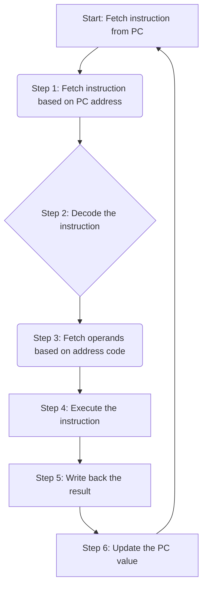
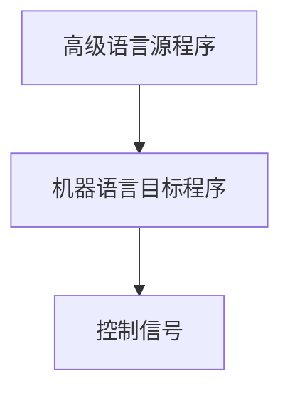
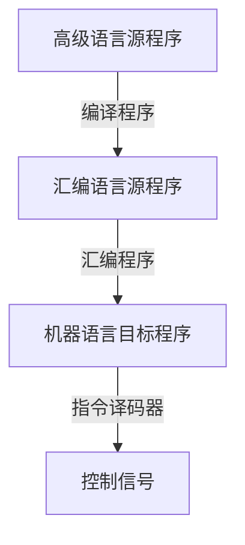

## Section 1
### 冯诺伊曼结构

- **最重要的思想**
	- “**存储程序(Stored-program)**”工作方式
	- CPU 有办法把程序和数据取出来，再存回存储器。循环往复，成为计算机。
- **主存**
	- **存放程序和数据**
- 自动逐条**取出**指令的部件 -控制器
- 具体**执行** 指令的部件（运算）
- 程序由指令构成

- 归纳
	- 计算机由 **运算器、控制器、存储器、输入设备和输出设备**组成
	-  存储器
		- 数据和指令
	- 控制器
		- 自动取出指令之 
	- 运算器
		- 加减乘除
	- 内部二进制表示**指令和数据**
		- **指令由什么构成**？
			- **操作码、地址码**

- **CPU**=运算器+控制器

- 双向的
	- 指令 vs 数据
	- 控制

- **术语**
	- **CPU**
	- **ALU**
		- Arithmetic Logic Unit
		- 算术逻辑单元
	- **IR**
		-  instruction register
		- 指令寄存器
	- **MDR**
		- memory data register
		- 存储器数据寄存器
	- **MAR**
		- memory address register
		- 存储器地址寄存器
	- **GPRs**
		- General Purpose Registers
		- 通用寄存器组
		- 有编号。决定地址。
	- **PC**
		- program counter
		- 程序计数器
		- 虽然不叫 register，也是 register（寄存器）

### 计算器是如何工作的？

- **程序在执行前**：
	1. 程序和指令事先存放在存储器中
		- 形式上没有区别，0/1 序列
	2. 每条指令和每个数据都有 **地址**
		1. 有存储必有地址
			1. 回想 **寄存器**：单一功能的寄存器没有地址（因为确定从哪里取，如 **PC**，**IR**）。通用寄存器有地址。
	3. 指令按序存放 **（不一定按序执行）**
		1. 回想高级语言中的 if-else，故可能跳过若干指令（不一定按序执行）
	4. **程序起始地址**（程序中的第一条指令的地址）置入 `PC` 
		1. 起始地址，是 1 个 `0`.  寄存器有固定位数，想像成 `0000 0000` 类似的一长串 bit 数的 `0` 更合适。

以上，**准备工作做完了**
- **开始执行程序后**
	- **计算机能自动取出一条一条指令执行，周而复始不停歇**
	- 执行过程无需人的干预。
	- **以下步骤在控制器的协调下完成**
#### 计算机工作流程
**计算机的工作流程**
- step 1: 根据 `PC` 取指令（例如按照 `0` 寻址），找到存储器的对应指令
- step 2： **指令译码**
- step 3:  按地址**取操作数。**（**指令的两要素：地址码和操作码**）
- step 4: **指令执行**
- step 5: （**回写**）按地址**回写结果**
- step 6: 修改 `PC` 的值（程序计数器）
- **注意**。step 3 和 step 5 **可能略过**

### 指令的执行
- 指令执行过程中。指令和数据被从存储器取到 CPU 中，存放在 CPU 的 register 中，指令 ***可以*** 在 `IR` 中，数据在 `GPR` 中（通用寄存器）

- 软硬件是如何合作的?

### 软硬件交界面 ： ISA

ISA：Instruction Set Architecture, ISA
- 软硬件交界面，**有时候直接称为架构**
- **ISA**：**指令集体系结构**

**ISA**是一种规约 (Specification)
	可执行的指令的集合，包括指令格式、操作种类以及每种操作对应的操作数的相应规定。
- ISA **是一个必要的抽象层**

### 回顾-程序开发历程

- 打孔纸带
	- 纸带代表二进制

- 汇编语言
	- 用符号表示跳转位置和变量位置
- **机器级语言**
	- 包括：**汇编语言、机器语言**
		- 直接面向计算机硬件
	- 唯一的区别：机器语言用二进制表示，汇编语言用符号表示。
- **汇编程序**
	- 能够将汇编语言源程序 `A` 转化为机器语言源程序 `B`
- **高级语言**
	- 具体机器结构无关
	- 与具体机器结构无关
	- 面向算法描述。
	- **处理逻辑**
		- 顺序结构
		- 选择结构
		- 循环结构

**现在我们能更清楚的阐述软硬件层次**

### 运行程序和计算机系统层次

- 早期
	- 直接输入指令和数据，启动后将第一条送入 PC 开始执行
- 现代计算机用高级语言编程
	- 

- **计算机系统的层次**
- 
	- 应用程序
	- 语言处理程序
		- 各种语言处理程序（编译、汇编、链接）
		- 运行时系统（库函数，调试，优化）
	- 操作系统
		- 人机交互界面
		- 提供服务功能（**设备驱动程序、时钟管理**）

- **归纳一下：软件**
	- System software（系统软件）
		- **简化编程，并使硬件资源被有效利用**
	- Application software
		- **解决具体应用问题/完成具体应用**

- 关于机器的例子
- 
- **8 位模型机M**主管一切。
- **除了指令之外的，在计算机可以简称、统称为数据**
	- 指令只可能存在 `IR`